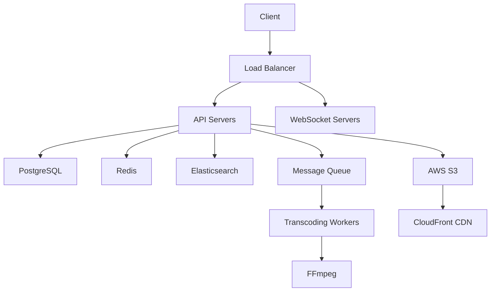

## 🎥 **Video Streaming Platform (YouTube-like) - Full Architecture**

### 🏗️ **System Architecture Overview**

```
┌─────────────────┐    ┌─────────────────┐    ┌─────────────────┐
│   Client Apps   │◄──►│   NestJS API    │◄──►│  Microservices  │
│ (Web/Mobile)    │    │   Gateway       │    │  (Transcoding)  │
└─────────────────┘    └─────────────────┘    └─────────────────┘
                               │
                               ▼
┌─────────────────┐    ┌─────────────────┐    ┌─────────────────┐
│   CDN (Cloud)   │    │   Database      │    │   File Storage  │
│ (Video Delivery)│    │   (PostgreSQL)  │    │   (AWS S3)      │
└─────────────────┘    └─────────────────┘    └─────────────────┘
                               │
                               ▼
┌─────────────────┐    ┌─────────────────┐    ┌─────────────────┐
│   Search Engine │    │   Message Queue │    │   Cache Layer   │
│  (Elasticsearch)│    │   (BullMQ)      │    │   (Redis)       │
└─────────────────┘    └─────────────────┘    └─────────────────┘
```

---

### 📦 **Core Modules & Implementation**

#### 1. **Video Management Module**

```typescript
// videos/videos.controller.ts
@Controller('videos')
export class VideosController {
  constructor(private readonly videosService: VideosService) {}

  @Post('upload')
  @UseInterceptors(FileInterceptor('video'))
  @UseGuards(JwtAuthGuard)
  async uploadVideo(
    @UploadedFile() file: Express.Multer.File,
    @Body() uploadDto: VideoUploadDto,
  ) {
    return this.videosService.processUpload(file, uploadDto);
  }

  @Get(':id/stream')
  async streamVideo(@Param('id') id: string) {
    return this.videosService.getStreamUrl(id);
  }
}
```

**Key Features:**

- **Chunked Uploads**: Resumable uploads using tus protocol
- **Transcoding Pipeline**:

  ```typescript
  // videos/videos.service.ts
  async processUpload(file: File, metadata: VideoUploadDto) {
    const video = await this.saveVideoMetadata(metadata);

    // Add transcoding job to queue
    await this.transcodingQueue.add('transcode', {
      videoId: video.id,
      inputPath: file.path,
      resolutions: ['1080p', '720p', '480p', '360p']
    });

    return video;
  }
  ```

- **Adaptive Streaming**: HLS/DASH manifest generation
- **Thumbnail Generation**: Extract frames at multiple intervals

#### 2. **Transcoding Microservice**

```typescript
// transcoding/transcoding.processor.ts
@Processor('video-transcoding')
export class TranscodingProcessor {
  @Process('transcode')
  async transcode(job: Job<TranscodeJob>) {
    const { videoId, inputPath, resolutions } = job.data;

    // Generate HLS playlist
    await this.ffmpegService.generateHLS(inputPath, videoId, resolutions);

    // Upload to S3
    await this.storageService.uploadDirectory(`videos/${videoId}`);

    // Update video status
    await this.videosService.markAsReady(videoId);
  }
}
```

**Transcoding Pipeline:**

1. **Input Validation**: Verify video format/codec
2. **Resolution Conversion**: Create multiple bitrate streams
3. **Segmentation**: Split into 2-10 second chunks
4. **Encryption**: DRM support (AES-128 encryption)
5. **Metadata Injection**: Add title/description to streams

#### 3. **User & Channel System**

```typescript
// users/users.entity.ts
@Entity()
export class User {
  @PrimaryGeneratedColumn()
  id: number;

  @Column()
  username: string;

  @Column({ nullable: true })
  channelName: string;

  @OneToMany(() => Video, (video) => video.uploader)
  videos: Video[];

  @OneToMany(() => Subscription, (sub) => sub.subscriber)
  subscriptions: Subscription[];
}
```

**Features:**

- Channel customization (banners, avatars, links)
- Subscription management
- User roles (Viewer, Creator, Moderator)
- Monetization settings (AdSense integration)

#### 4. **Real-time Engagement System**

```typescript
// notifications/notifications.gateway.ts
@WebSocketGateway()
export class NotificationsGateway {
  @SubscribeMessage('subscribeToVideo')
  handleSubscribe(client: Socket, videoId: string) {
    client.join(`video-${videoId}`);
  }

  @SubscribeMessage('sendComment')
  handleComment(client: Socket, payload: CommentDto) {
    this.server.to(`video-${payload.videoId}`).emit('newComment', payload);
  }
}
```

**Real-time Features:**

- Live comments during playback
- View count updates
- Like/dislike synchronization
- Notification system (new uploads, replies)

#### 5. **Search & Discovery**

```typescript
// search/search.service.ts
@Injectable()
export class SearchService {
  constructor(
    @InjectRepository(Video)
    private videoRepository: Repository<Video>,
    private elasticsearchService: ElasticsearchService,
  ) {}

  async search(query: string) {
    const { body } = await this.elasticsearchService.search({
      index: 'videos',
      body: {
        query: {
          multi_match: {
            query,
            fields: ['title^3', 'description', 'tags'],
          },
        },
      },
    });
    return body.hits.hits;
  }
}
```

**Search Features:**

- Full-text search (title, description, tags)
- Filtering by duration, upload date, resolution
- Search relevance scoring
- Trending recommendations algorithm

---

### 🛠️ **Technology Stack**

| Component              | Technology Choices                           |
| ---------------------- | -------------------------------------------- |
| **Backend**            | NestJS, Node.js 18+                          |
| **Database**           | PostgreSQL (primary), Elasticsearch (search) |
| **Cache**              | Redis (sessions, rate limiting)              |
| **Queue System**       | BullMQ (Redis-based)                         |
| **File Storage**       | AWS S3 + CloudFront CDN                      |
| **Video Processing**   | FFmpeg (with custom wrappers)                |
| **Streaming Protocol** | HLS (HTTP Live Streaming)                    |
| **Real-time**          | Socket.IO                                    |
| **Authentication**     | JWT + OAuth 2.0 (Google/Facebook)            |
| **Containerization**   | Docker + Kubernetes                          |
| **Monitoring**         | Prometheus + Grafana                         |

---

### 📊 **Data Models**

#### Video Entity

```typescript
@Entity()
export class Video {
  @PrimaryGeneratedColumn()
  id: number;

  @Column()
  title: string;

  @Column('text')
  description: string;

  @Column('simple-array')
  tags: string[];

  @Column()
  duration: number; // in seconds

  @Column({ default: 0 })
  views: number;

  @Column({ default: 0 })
  likes: number;

  @Column({ default: 0 })
  dislikes: number;

  @Column({ type: 'enum', enum: VideoStatus })
  status: VideoStatus; // UPLOADING, PROCESSING, READY, FAILED

  @ManyToOne(() => User, (user) => user.videos)
  uploader: User;

  @Column()
  s3Path: string;

  @Column({ nullable: true })
  thumbnailUrl: string;
}
```

#### Playlist Entity

```typescript
@Entity()
export class Playlist {
  @PrimaryGeneratedColumn()
  id: number;

  @Column()
  title: string;

  @ManyToOne(() => User)
  creator: User;

  @ManyToMany(() => Video)
  videos: Video[];

  @Column({ default: false })
  isPublic: boolean;
}
```

---

### 🚀 **Key Features Implementation**

#### 1. **Adaptive Bitrate Streaming**

```typescript
// streaming/streaming.service.ts
@Injectable()
export class StreamingService {
  async getManifestUrl(videoId: string, quality: string) {
    const signedUrl = await this.s3Service.getSignedUrlPromise('getObject', {
      Bucket: 'video-bucket',
      Key: `videos/${videoId}/${quality}/playlist.m3u8`,
      Expires: 3600, // 1 hour expiry
    });

    return signedUrl;
  }
}
```

#### 2. **Recommendation Engine**

```typescript
// recommendations/recommendations.service.ts
@Injectable()
export class RecommendationsService {
  async getForUser(userId: number) {
    // Hybrid approach:
    const collaborative = await this.collaborativeFiltering(userId);
    const contentBased = await this.contentBased(userId);
    const trending = await this.trendingVideos();

    return this.mergeAndRank([collaborative, contentBased, trending]);
  }
}
```

#### 3. **Content Moderation**

```typescript
// moderation/moderation.service.ts
@Injectable()
export class ModerationService {
  @Process('checkContent')
  async checkVideo(job: Job<{ videoId: number }>) {
    const video = await this.videosService.findOne(job.data.videoId);

    // AI-based content check
    const moderationResult = await this.aiService.moderateContent(video.s3Path);

    if (moderationResult.flagged) {
      await this.handleFlaggedContent(video, moderationResult.reasons);
    }
  }
}
```

---

### 🔒 **Security Measures**

1. **Video Protection**:
   - Signed URLs with expiration
   - Domain-level access restrictions
   - Token-based authentication for private videos

2. **Upload Security**:
   - File type validation
   - Malware scanning
   - Size limits (e.g., 2GB max)

3. **API Security**:
   - Rate limiting (express-rate-limit)
   - Helmet.js for security headers
   - SQL injection prevention (TypeORM)
   - XSS protection

---

### 📈 **Scalability Strategy**

1. **Horizontal Scaling**:
   - Stateless API servers behind load balancer
   - Database read replicas
   - Sharded user data

2. **CDN Integration**:
   - CloudFront for video delivery
   - Edge caching for thumbnails
   - Geo-restricted content delivery

3. **Performance Optimization**:
   - Database indexing on frequently queried fields
   - Redis caching for video metadata
   - Lazy loading for comments

---

### 💰 **Monetization Features**

1. **Ad Integration**:
   - Pre-roll/mid-roll ads
   - Ad break insertion in HLS streams
   - Ad revenue sharing model

2. **Premium Features**:
   - Subscription-based content
   - Pay-per-view videos
   - Channel memberships

3. **Analytics Dashboard**:
   ```typescript
   // analytics/analytics.controller.ts
   @Get('dashboard')
   @UseGuards(JwtAuthGuard)
   async getDashboard(@Req() req) {
     return this.analyticsService.getCreatorStats(req.user.id);
   }
   ```

---

### 🧪 **Testing Strategy**

1. **Unit Tests**:

   ```typescript
   // videos/videos.service.spec.ts
   describe('VideosService', () => {
     it('should process video upload', async () => {
       const result = await service.processUpload(mockFile, mockDto);
       expect(result).toBeDefined();
       expect(transcodingQueue.add).toHaveBeenCalled();
     });
   });
   ```

2. **Integration Tests**:
   - API endpoint testing with Supertest
   - Database transaction rollbacks

3. **Load Testing**:
   - Simulate 10K concurrent users
   - Transcoding queue performance
   - Database query optimization

---

### 🚀 **Deployment Architecture**



**CI/CD Pipeline:**

1. GitHub Actions for automated testing
2. Docker image building
3. Kubernetes deployment with Helm
4. Canary releases for new features

---

### 📱 **Client Integration**

**Mobile App (React Native):**

```javascript
// VideoPlayer.js
import Video from 'react-native-video';

const VideoPlayer = ({ videoId }) => {
  const [manifestUrl, setManifestUrl] = useState(null);

  useEffect(() => {
    fetchStreamUrl(videoId).then((url) => setManifestUrl(url));
  }, [videoId]);

  return <Video source={{ uri: manifestUrl }} resizeMode="contain" controls />;
};
```

**Web Player (React):**

```javascript
// VideoPlayer.jsx
import HLS from 'hls.js';

const VideoPlayer = ({ videoId }) => {
  const videoRef = useRef();

  useEffect(() => {
    if (HLS.isSupported()) {
      const hls = new HLS();
      hls.loadSource(`/api/videos/${videoId}/stream`);
      hls.attachMedia(videoRef.current);
    }
  }, [videoId]);

  return <video ref={videoRef} controls />;
};
```

---

This architecture provides a production-ready foundation for a video streaming platform with:

- **Scalability** to handle millions of users
- **Resilience** through microservices and queues
- **Security** at all levels
- **Monetization** capabilities
- **Advanced features** like recommendations and real-time engagement

The implementation leverages NestJS's modular architecture to maintain clean separation of concerns while enabling complex video processing workflows. The system is designed to grow from startup to enterprise scale with proper CI/CD and monitoring practices.
